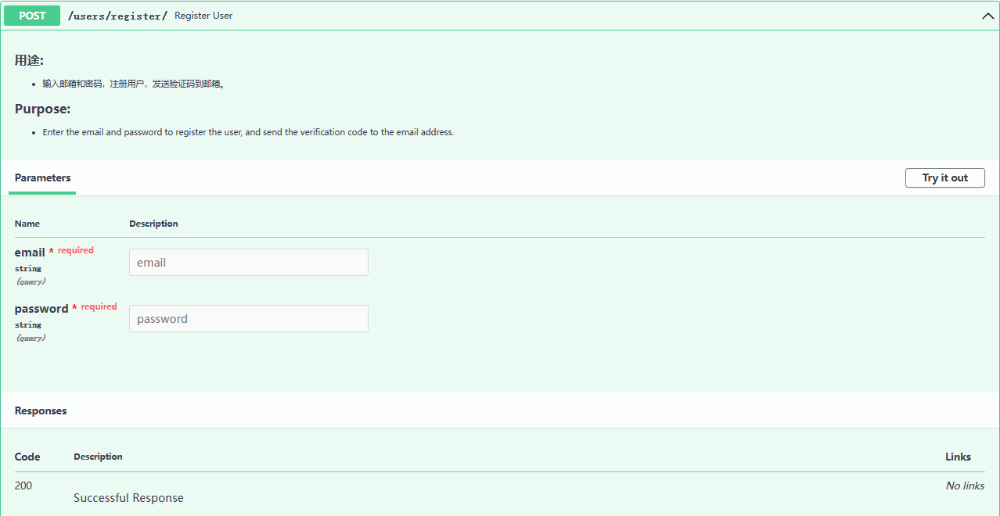

# kkkkkk-10086
## 没骗你，真没学过js

#### 使用gitee
```
git clone --depth=1 https://gitee.com/ikenxuan/kkkkkk-10086.git ./plugins/kkkkkk-10086/
```
#### 使用GitHub
```
git clone --depth=1 https://github.com/ikenxuan/kkkkkk-10086.git ./plugins/kkkkkk-10086/
```


# 此插件为本人自用 ！自用 ！ 自用 ！
### 若使用TikHub API功能需先注册TikHub账号，注册成功后将对应内容填写到
`/plugins/kkkkkk-10086/config/account.yaml`

重启后向机器人发送`#获取token`以获取账号APIKey

## [点我直达注册页面](https://api.tikhub.io/#/Authorization/register_user_users_register__post)
[](https://api.tikhub.io/#/Authorization/register_user_users_register__post)
## 免责声明

1. 图片与其他素材均来自于网络，仅供交流学习使用，如有侵权请联系，会立即删除
2. 功能仅限内部交流与小范围使用，请勿将Yunzai-Bot及kkkkkk-10086用于以盈利为目的的场景


