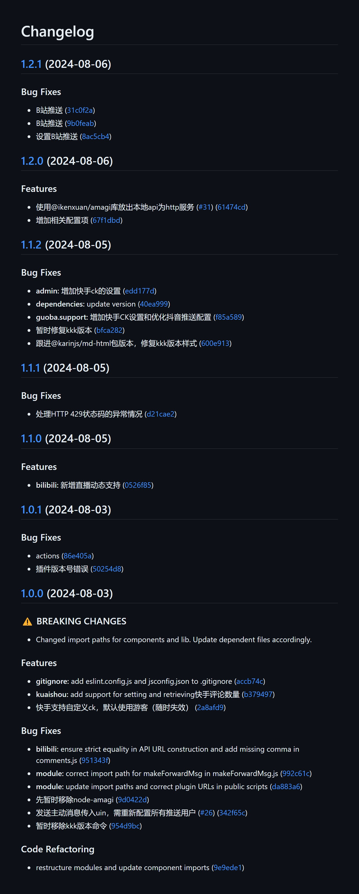
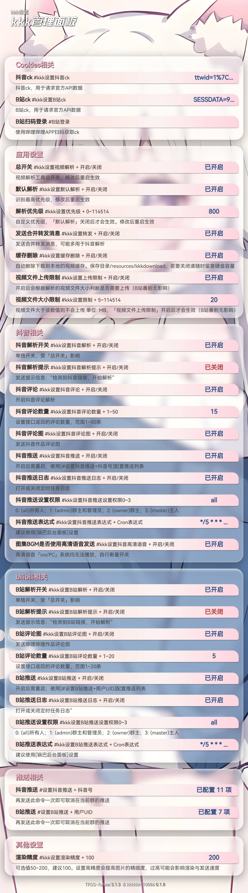

# 其他功能

## 配置不同平台的 cookies
本插件<mark>没有后门</mark>，本插件<mark>不会上传</mark>有关你的任何信息到第三方。<br>
你所配置的ck只会用于请求官方API接口
### 如何获取 Cookies ？
<mark>所有平台都可用</mark>该方法来获取ck
::: details PC浏览器

**_总结：找到携带Cookie的请求后，复制请求头中的Cookie_**
> **看这个视频就懂了**
<div>
  <Video src="/kkkkkk-10086/video.mp4" />
</div>
<br>
<details>
<summary>图文版，点击展开</summary>

找到携带 Cookie 的请求复制请求头中的 Cookie


</details>

:::

::: details 移动端（Android）
使用 [via 浏览器](https://res.viayoo.com/v1/via-release-cn.apk) 访问以下网址的网页版并<mark>登录你自己的账号</mark><br><br>抖音: [www.douyin.com](https://www.douyin.com) <br> 哔哩哔哩: [www.bilibili.com](https://www.bilibili.com) <br> 快手: [www.kuaishou.com](https://www.kuaishou.com)<br><br>登录成功后点击 **`左上角按钮`** => **`查看 Cookies`** => **`复制文本`**
:::

### 如何配置？
打开 `config/config/cookies.yaml` 根据需要配置ck<br>
注意冒号后有个空格！

::: code-group
```yaml{2,5,8} [config/config/cookies.yaml]
# 抖音ck
douyin: 此处填上你的抖音ck

# B站ck
bilibili: 此处填上你的B站ck 

# 快手ck
kuaisha: 此处填上你的快手ck
```
:::

## 其他功能
更多信息可使用 `#kkk帮助` `#kkk版本` `#kkk设置`查看

::: warning 警告
以下内容可能具有时效性
:::

::: details #kkk 帮助

:::

::: details #kkk 版本

:::

::: details #kkk 设置

:::
