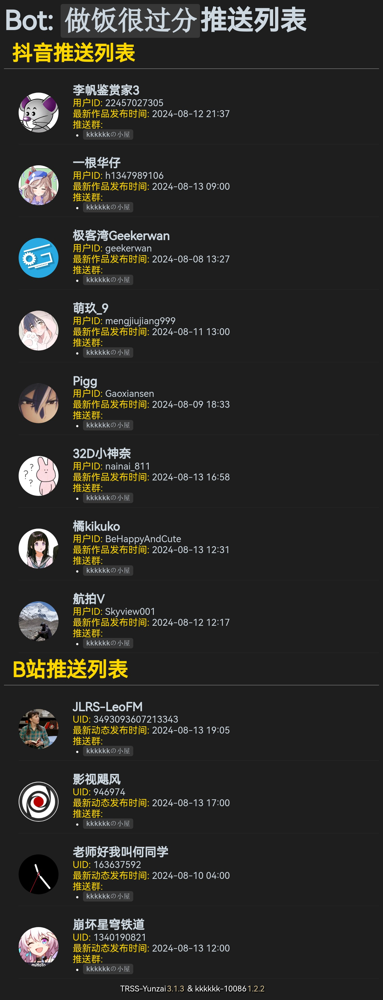

# 推送功能

该功能为定时任务，默认每 10 分钟执行一次推送（可自定义推送间隔，建议使用后台面板修改或直接更改配置文件，不建议使用命令修改）
::: warning 警告
推送功能 **_默认关闭_**，即使配置了推送博主/UP主也不会自动开启<br>请先使用 `#kkk设置抖音/B站推送开启` 或后台面板设置开启推送功能
:::
## 配置方法

### 使用命令

|      | 抖音                           | B 站                    |
| ---- | ------------------------------ | ----------------------- |
|      | `#设置抖音推送 + 抖音号`       | `#设置B站推送 + UID`    |
| 例子 | `#设置抖音推送yuanshen_mihoyo` | `#设置B站推送401742377` |

::: tip 说明
在发送一次 `相同的命令` 即可取消在当前群的推送
:::


### 手动修改配置文件
请务必查看该例子后再手动修改，也可使用命令快速配置
::: code-group

```yaml [pushlist.yaml]
 # 抖音推送列表
 douyin:
   -
     # 抖音用户（可不填，执行推送时会自动填上）
     sec_uid: 
     # 抖音号（必填）
     short_id: 
     # 推送群号和机器人账号，多个则使用逗号隔开（必填，例子：[12345678:87654321, 11451419:88888888]，群号就是11451419，机器人账号就是88888888）
     group_id:
       - 1145141919810:8888888888
     # 这个博主的名字信息（可不填，执行推送时会自动填上）
     remark: 
 # B站推送列表
 bilibili:
   -
     # B站用户（必填）
     host_mid: 
     # 推送群号和机器人账号，多个则使用逗号隔开（必填，例子：[12345678:87654321, 11451419:88888888]，群号就是11451419，机器人账号就是88888888）
     group_id:
       - 1145141919810:8888888888
     # 这个UP主的名字信息（可不填，执行推送时会自动填上）
     remark: 
```

:::


<div align="center" style="padding: 2em; margin: 2em 0; border: 1px solid var(--vp-c-text-1); border-radius: 8px">

<p align="left">问: 推送的逻辑是什么？</p>
<p align="left">答: 只会推送博主/UP主在当天内发布的所有内容</p>

公式（单位：timestamp）: [^1]
$$(\text{now time} - \text{86400}) < \textcolor{red}{\text{true}} < \text{now time}$$

[^1]: 1天 = 86400
</div>

## 样式

::: warning 警告
以下内容可能具有时效性
::: details #kkk 推送列表

:::

## TODO

- [x] 往后可能会根据配置文件内容进行内容渲染，而不是通过数据库缓存<br>由 [**@ikenxuan**](https://github.com/ikenxuan) 在 [**95dcffa**](https://github.com/ikenxuan/kkkkkk-10086/commit/95dcffab00f8afc1484a1e350911636b2d92006d) 完成
- [ ] 当机器人被踢时自动删除该群的推送